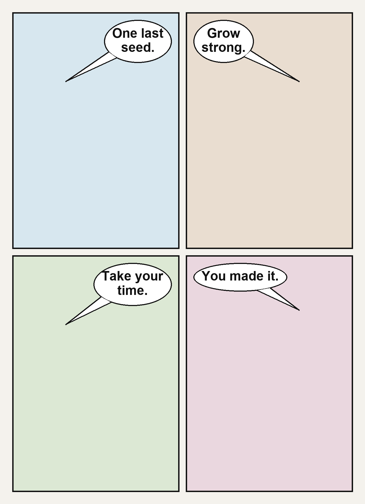

# ComfyUI Illustrious Comic Lettering

Deterministic speech bubbles and readable dialogue for finished 2×2 comic pages in ComfyUI.

This node solves a common diffusion-comic problem: the artwork may look right, but generated lettering is misspelled, duplicated, mixed with Japanese glyphs, or printed on top of earlier text. Instead of asking the image model to spell dialogue, this extension adds clean bubbles and real font-rendered text **after VAE Decode**.



## Features

- Exactly one configurable bubble per panel in a fixed 2×2 page.
- Deterministic Pillow-based rendering—no hidden AI service or extra model.
- Automatic line wrapping and font-size reduction.
- Padding, panel-safe clamping, bubble-width, tail-size, outline, color, and vertical-position controls.
- Speaker-side controls; bubbles are placed opposite the speaker and tails point back toward them.
- Outputs both the finished `IMAGE` and a combined `MASK` for optional compositing or refinement.
- Works after any image model or checkpoint; designed around Illustrious XL comic workflows.

## Installation

### Git installation

From `ComfyUI/custom_nodes`:

```bash
git clone https://github.com/katorikonoe-ai/ComfyUI-IllustriousComicLettering.git
cd ComfyUI-IllustriousComicLettering
pip install -r requirements.txt
```

Restart ComfyUI, then search for `Illustrious Comic Lettering - 4 Panel` under `Illustrious Comic/Lettering`.

### Manual installation

Download the repository ZIP and extract it to:

```text
ComfyUI/custom_nodes/ComfyUI-IllustriousComicLettering
```

Install `requirements.txt` in ComfyUI's Python environment and restart ComfyUI.

## Recommended graph

```text
Checkpoint + prompts → sampler → VAE Decode
                                   │
                                   ▼
                 Illustrious Comic Lettering - 4 Panel
                              ├─ lettered_page → Preview/Save Image
                              └─ bubble_mask   → optional post-processing
```

An editable example workflow is included at [`Illustrious_ComicFactory_DeterministicLettering_v10.json`](Illustrious_ComicFactory_DeterministicLettering_v10.json).

The example may reference checkpoint or LoRA filenames from its original environment. Select equivalent locally installed models before queuing it. This repository does not redistribute models.

## Prompting rule: prevent “text inside text”

The image model should create the comic art and reserve space for bubbles, but it should **not** generate final dialogue.

Recommended positive wording:

```text
one complete vertical comic page, exactly four equal rectangular panels in a clean 2 by 2 grid,
consistent white gutters, even white outer margin, crisp black borders,
clear empty negative space near the top outer corner of every panel for later lettering
```

Recommended negative wording:

```text
letters, readable text, dialogue, captions, subtitles, sound effects, Japanese writing,
vertical writing, gibberish, watermark, logo, text inside speech bubbles
```

If the generated art already contains text, this node cannot semantically erase it. Regenerate with the no-text prompt, inpaint the old text, or place the new opaque bubble fully over it.

## Inputs

| Input | Purpose |
|---|---|
| `image` | Decoded 2×2 comic page (`IMAGE`, batch supported). |
| `panel_1_text` … `panel_4_text` | Exact dialogue rendered into each panel. |
| `panel_1_speaker` … `panel_4_speaker` | `left`, `center`, or `right`; controls bubble placement and tail direction. |
| `font_name` | Font filename or accessible font path. Falls back to common system fonts. |
| `font_size` / `min_font_size` | Preferred and lowest automatic lettering size. |
| `padding` | Space around fitted text. |
| `outer_margin` / `gutter` | Geometry used to locate the four source panels. |
| `panel_safe_margin` | Horizontal safety distance from panel edges. |
| `bubble_width_limit` | Maximum bubble width as a percentage of panel width. Start at `45`. |
| `tail_length` / `tail_width` | Tail size in pixels. Recommended starting values: `42` / `22`. |
| `bubble_top_offset` | Distance from the top of each panel in pixels. Start at `26`. |
| `border_width` | Bubble border thickness. |
| color inputs | Text, fill, and outline colors in hex format. |

Recommended v1.1 starting preset for a 1600×2200 page:

```text
font_size: 34
min_font_size: 16
padding: 24
outer_margin: 45
gutter: 24
panel_safe_margin: 34
border_width: 3
font_name: DejaVuSans.ttf
bubble_width_limit: 45
tail_length: 42
tail_width: 22
bubble_top_offset: 26
```

Keep dialogue concise. Four to seven words per panel is the most reliable range.

## Guarantees and limitations

The node guarantees deterministic placement and font rendering for supplied text. It does **not** guarantee that the underlying diffusion image has correct characters, hands, panel geometry, or empty bubble space.

Current scope:

- Fixed 2×2 panel geometry.
- One bubble per panel.
- Horizontal text, optimized for Latin-script dialogue.
- Rule-based placement rather than face detection or semantic scene analysis.

## Local test

```bash
python test_node.py
```

The test validates text fitting and bubble rendering without starting ComfyUI. A full runtime smoke test should also load the example workflow and confirm the node appears under `Illustrious Comic/Lettering`.

## Publishing notes

Before publishing to the ComfyUI Registry, replace the placeholders in `pyproject.toml`, create your publisher identity, and increment the semantic version for each release. GitHub publishing alone does not require a Registry account.

## License

MIT. See [LICENSE](LICENSE).
